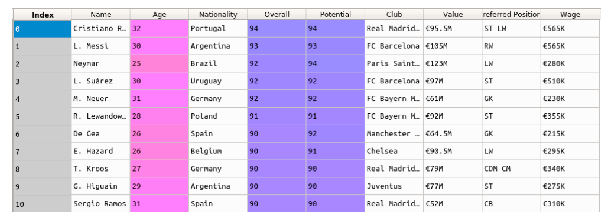

# LinearRegression

# Problem Statement

You are a data scientist who wishes to make it big by becoming a football club manager. A rich club has decided to hire you as their manager. You have all the money to build a team from scratch.

Your aim is to find out the best squad for the upcoming football championship.

# About the Dataset:
Snapshot of the data you will be working on: 

train.csv :
The data file train.csv contains the 14384 instances with the 9 features including the target feature.

test.csv :
The datafile test.csv contains the 3597instances with the 8 features excluding the target feature.
